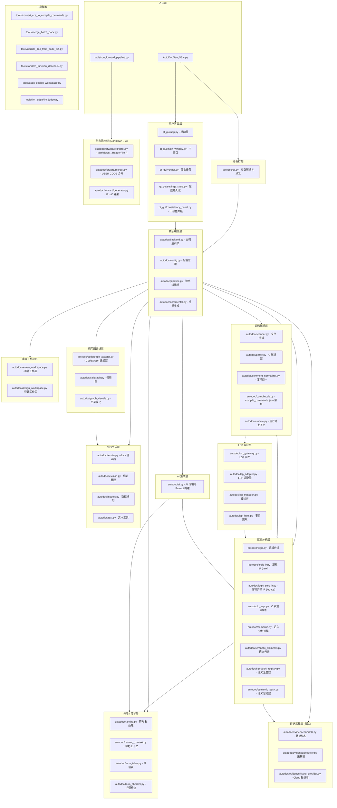
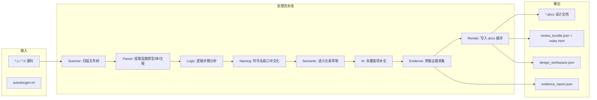
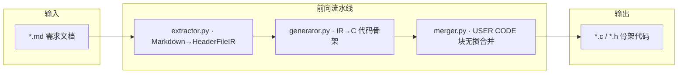

# AutoDocGen V1.4 — 架构总览

## 分层架构图



## 数据流 (前向: 源码→文档)



## 数据流 (逆向: Markdown→C 骨架)



## 模块依赖关系 (核心路径)

```mermaid
flowchart TB
    cli["autodoc/cli.py"] --> backend["autodoc/backend.py"]
    backend --> config["autodoc/config.py"]
    backend --> pipeline["autodoc/pipeline.py"]
    backend --> scanner["autodoc/scanner.py"]
    backend --> parse["autodoc/parse.py"]
    backend --> logic["autodoc/logic.py"]
    backend --> logic_ir["autodoc/logic_ir.py"]
    backend --> naming["autodoc/naming.py"]
    backend --> render["autodoc/render.py"]
    backend --> ai["autodoc/ai.py"]
    backend --> evidence["autodoc/evidence/collector.py"]
    backend --> lsp_facts["autodoc/lsp_facts.py"]
    backend --> incremental["autodoc/incremental.py"]
    backend --> semantic["autodoc/semantic.py"]
    backend --> codegraph["autodoc/codegraph_adapter.py"]
    backend --> revision["autodoc/revision.py"]
    backend --> review["autodoc/review_workspace.py"]
    backend --> design_ws["autodoc/design_workspace.py"]
    parse --> compile_db["autodoc/compile_db.py"]
    parse --> comment_norm["autodoc/comment_normalizer.py"]
    parse --> runtime["autodoc/runtime.py"]
    logic --> logic_step_ir["autodoc/logic_step_ir.py"]
    logic --> c_expr["autodoc/c_expr.py"]
    logic --> term_checker["autodoc/term_checker.py"]
    logic --> semantic_registry["autodoc/semantic_registry.py"]
    naming --> naming_context["autodoc/naming_context.py"]
    naming --> semantic_pack["autodoc/semantic_pack.py"]
    naming --> semantic_elements["autodoc/semantic_elements.py"]
    naming --> term_table["autodoc/term_table.py"]
    ai --> naming
    evidence --> clang["autodoc/evidence/clang_provider.py"]
    lsp_facts --> lsp_adapter["autodoc/lsp_adapter.py"]
    lsp_adapter --> lsp_gateway["autodoc/lsp_gateway.py"]
    lsp_gateway --> lsp_transport["autodoc/lsp_transport.py"]
    render --> models["autodoc/models.py"]
    render --> text["autodoc/text.py"]
    render --> ui_utils["autodoc/utils.py"]
```



## 目录结构

```
AutodocGen-Main/
├── AutoDocGen_V1.4.py          # 总体入口
├── autodocgen.ini              # 本地配置
├── autodoc/
│   ├── backend.py              # 核心主调度 (6923行)
│   ├── cli.py                  # 命令行解析 + GUI 启动
│   ├── config.py               # GenConfig 配置模型
│   ├── pipeline.py             # 流水线编排 (回归补跑等)
│   ├── parse.py                # C 源码解析器
│   ├── scanner.py              # 文件扫描仪
│   ├── logic.py                # 逻辑分析引擎
│   ├── logic_ir.py             # 逻辑 IR (forward pipeline)
│   ├── logic_step_ir.py        # 逻辑步骤 IR
│   ├── c_expr.py               # C 表达式解析
│   ├── semantic.py             # 语义分析引擎
│   ├── semantic_elements.py    # 语义元素定义
│   ├── semantic_registry.py    # 语义元素注册
│   ├── semantic_pack.py        # 语义包构建
│   ├── naming.py               # 符号名收口/中文处理
│   ├── naming_context.py       # 命名上下文
│   ├── term_table.py           # 术语表
│   ├── term_checker.py         # 术语一致性检查
│   ├── ai.py                   # AI 补全 (4941行)
│   ├── render.py               # docx 渲染 (2291行)
│   ├── incremental.py          # 增量生成
│   ├── revision.py             # 修订管理
│   ├── models.py               # 数据模型
│   ├── text.py                 # 文本工具
│   ├── utils.py                # 通用工具
│   ├── runtime.py              # 运行时上下文
│   ├── compile_db.py           # compile_commands.json
│   ├── comment_normalizer.py   # 注释归一化
│   ├── codegraph_adapter.py    # CodeGraph 适配器
│   ├── callgraph.py            # 调用图
│   ├── graph_visuals.py        # 图可视化
│   ├── lsp_gateway.py          # LSP 网关
│   ├── lsp_adapter.py          # LSP 适配器
│   ├── lsp_transport.py        # LSP 传输层
│   ├── lsp_facts.py            # LSP 事实提取
│   ├── design_workspace.py     # 设计工作区
│   ├── review_workspace.py     # 审查工作区
│   ├── context_pack.py         # 上下文打包
│   ├── _legacy_support.py      # 旧版向后兼容
│   ├── evidence/               # 旁路证据采集
│   │   ├── models.py, collector.py, clang_provider.py
│   └── forward/                # 前向代码生成
│       ├── extractor.py, generator.py, merger.py
├── qt_gui/                     # PyQt5 GUI
│   ├── app.py, main_window.py
│   ├── runner.py, settings_store.py
│   └── consistency_panel.py
└── tools/                      # 辅助工具脚本
    ├── run_forward_pipeline.py
    └── ...
```

## 关键设计决策

| 决策 | 说明 |
|---|---|
| **增量生成** | 缓存 render XML 元素 + 源码 hash，仅重渲染变更函数 |
| **回归补跑** | AI 生成质量得分低时自动多轮重试，逐步改进逻辑文本 |
| **旁路证据** | evidence 系统默认关闭 (`shadow mode`)，不影响 docx 输出 |
| **LSP 集成** | 可选 clangd LSP 获取精确类型/成员/调用上下文 |
| **前后向双管道** | `源码→文档` (backend) + `Markdown→C` (forward) |
